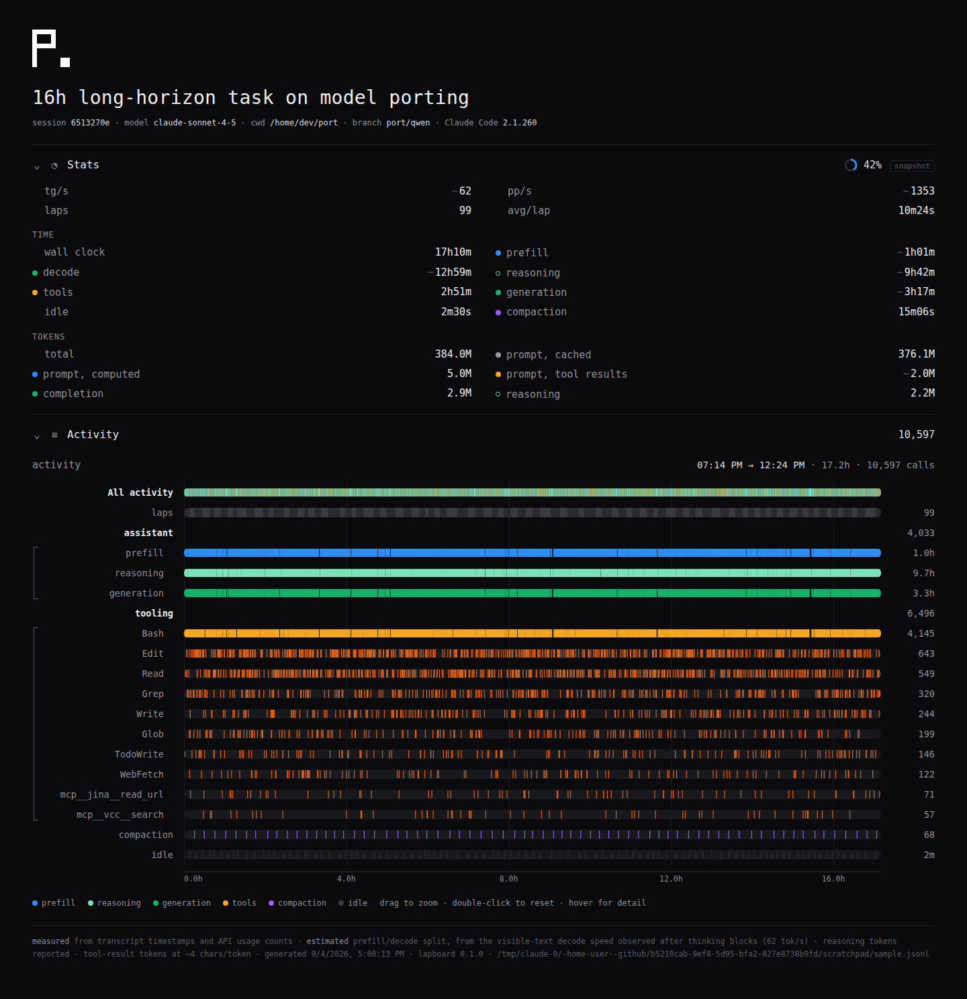

# lapboard

A telemetry panel for long-horizon Claude Code sessions. Point it at a session
transcript and it renders one page: throughput, an additive wall-clock split, token
accounting, and a per-row timeline of every call the agent made.



It is a clean-room equivalent of the run-stats panel Han Xiao posted for a 16-hour
autonomous coding run ([the post](https://x.com/hxiao/status/2095609195030864347)),
rebuilt for Claude Code transcripts. Python standard library only, no build step.

```
python3 lapboard.py list                          # sessions under ~/.claude/projects, newest first
python3 lapboard.py build latest -o panel.html    # self-contained HTML, open it anywhere
python3 lapboard.py serve latest --open           # live panel that follows a running session
python3 lapboard.py json  <session-id-or-path>    # the computed numbers, for other frontends
```

`latest`, a session id prefix, a project directory, or a path to a `.jsonl` all work.
Subagent transcripts stored next to the session are merged in (`--no-subagents` to skip).

## What the panel shows

**Header.** The run title (the first prompt unless `--title` is given), session id,
model, working directory, branch, CLI version.

**Stats.**

| item | meaning |
|---|---|
| tg/s | completion tokens per second of decode time (reasoning + generation) |
| pp/s | computed prompt tokens per second of prefill time |
| laps · avg/lap | one lap per user prompt (an autonomous loop that re-prompts makes one lap per iteration); mean time from one prompt to the next |
| ring | context-window fill of the latest request (200k, or 1M once a request exceeds 200k; `--context-window` overrides) |
| TIME | wall clock = prefill + reasoning + generation + tools + compaction + idle. Every instant of the session is attributed to exactly one phase, so the parts add up |
| TOKENS | total = prompt computed + prompt cached + completion. Reasoning tokens are a subset of completion; tool-result tokens are a subset of prompt |

**Activity.** One row per category over wall-clock time, with a count or a total on the
right: an "All activity" strip, the laps numbered in order, the three assistant phases,
one row per tool name (rare tools fold into "other tools"), compactions, interrupts and
API errors, and idle stretches. Hover any bar for the call behind it (timings, tokens,
the command or file). Drag to zoom, double-click to reset. In `serve` mode the page
polls the transcript and the spinner next to the ring shows it is live.

## How it works

Claude Code appends one JSON line per event to
`~/.claude/projects/<project>/<session>.jsonl`. lapboard reads that file, and, in
`serve` mode, keeps reading it as it grows.

- **Model calls.** Each streamed content block of a response is its own entry, with a
  timestamp and the request's usage. Blocks are grouped by `requestId`. A request starts
  at the last non-assistant entry before its first block (the prompt or tool result that
  triggered it) and ends at its last block.
- **Tool calls.** A `tool_use` block is paired with the `tool_result` that carries its
  id. Tools start as soon as their block has streamed, so calls in one message overlap
  each other and the tail of the stream; the wall-clock split handles overlap by giving
  model phases priority over tools.
- **Laps.** Every user prompt that is not a tool result, a compaction summary, or an
  interrupt marker opens a lap.
- **Compactions.** `compact_boundary` system entries and `isCompactSummary` messages.
  The compaction interval runs from the last entry before the boundary to the summary.
- **Idle.** Time with nothing running, split into waiting for the user (an idle stretch
  that ends at a prompt) and overhead.

### Measured vs. estimated

Everything above is measured from timestamps and usage counts. The transcript does not
record the API's time to first token, so the split of a request's latency between
prefill and decode is estimated:

1. For requests that stream visible text or tool calls after a thinking block, the time
   from the end of thinking to the last block is pure decode of a known number of
   tokens. Pooled over the session, that gives the decode speed.
2. Each request's thinking phase is then split: thinking tokens divided by that speed is
   reasoning time, and the remainder of the time-to-end-of-thinking is prefill.
3. Requests without a thinking block get decode time from their output tokens and the
   rest as prefill.

Estimated figures carry a `~` in the panel. On a synthetic run with known timings the
estimate lands within a few percent (see `tests/`). If a session never streams text
after thinking, the split is not separable and prefill is reported as zero.

Two more approximations: tool-result tokens are counted at four characters per token,
and reasoning tokens fall back to a character-ratio estimate when the API does not
report `thinking_tokens`. The footer of each panel states which applies.

## Data model

`lapboard.py json` emits what the page renders:

```
meta   title, session id, models, cwd, branch, estimates used, live flag
base   session start (epoch seconds); all times below are relative to it
stats  tg_s, pp_s, laps, avg_lap_s, time{...}, tokens{...}, context{...}, counts{...}
calls  k=m model call {t0,t1,p:[prefill_end,reasoning_end],tok:[computed,cached,out,thinking],lap,stop,tools}
       k=t tool call  {t0,t1,n:name,l:label,ch:result chars,err,open}
       k=c compaction, k=x interrupt, k=e API error
laps   {n,t0,t1,calls,tools,l:prompt}
tools  per-name count, total seconds, errors
idle   [t0,t1,'w'|'o'] waiting-for-user or overhead
```

To reproduce the screenshot above without a real session:

```
python3 examples/make_sample.py --hours 16 --laps 99 --out /tmp/sample.jsonl
python3 lapboard.py build /tmp/sample.jsonl --title "16h long-horizon task on model porting" -o sample.html
```

## Files

```
lapboard.py              parser, metrics, CLI (list / build / serve / json)
panel.html               the page; build inlines the data into it
examples/make_sample.py  synthetic 16h transcript generator with ground-truth timings
examples/sample-panel.png    the panel built from that synthetic run (screenshot above)
tests/test_lapboard.py   python3 -m unittest discover -s tests
```

## Limitations

- Timing resolution is the transcript's: whole requests and tool calls, not token
  streams. Permission prompts and hook execution inside a tool call count as tool time.
- Sessions resumed with `--resume` continue in the same file; sessions from before
  Claude Code wrote per-block entries lack the reasoning/generation split.
- Cost is not computed; pricing depends on the model and cache tier.
